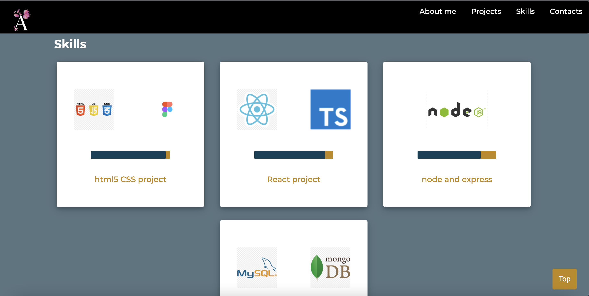

# Anjula's Portfolio

## [meanjula.github.io](https://meanjula.github.io/)

## Table of contents

- [General info](#general-info)
- [Technologies](#technologies)
- [Screenshots](#portfolio-screenshots)
- [Sources](#Sources)

## General info

Portfolio page created using html, css and javascript.
Icons are imported from fontawesome and material icons page.
Favicon created using figma and favicon converter.
Designed logo in figma.

## Screenshots

## Technologies

- HTML5
- CSS3
- JavaScript
- Figma
- favicon generator

## Sources

Images from [Unsplash](https://unsplash.com/).
Favicon generator source [favicon](https://favicon.io/favicon-converter/).
